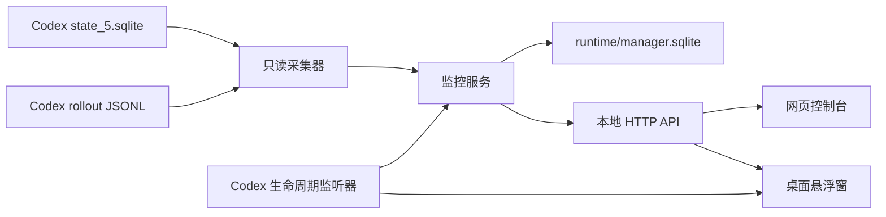

# Codex Token 用量监控

面向 Windows Codex Desktop 的本地只读 Token 与额度监控工具。项目包含一个始终置顶的桌面悬浮窗，以及一个适配电脑和 iPad 的实时网页控制台。

它会读取 Codex 已经写入本机的任务索引、rollout 日志和额度窗口，不修改 Codex 数据库、日志、任务内容或 Git 分支。

> [!IMPORTANT]
> 网页中的预算百分比是本项目生成的规划建议，不是 OpenAI 官方配额，也不会自动暂停、中断或恢复 Codex 任务。

## 功能概览

### 桌面悬浮窗

- Codex Desktop 启动后自动出现，Codex 完全退出后自动关闭。
- 每秒刷新短周期额度、周额度、今日 Token、活动任务、本次 Token 和消耗速度。
- 多个并行任务分别显示，不把不同任务的本次用量合并成一条记录。
- 任务结束后保留最近一批工作结果，直到下一批任务开始。
- 支持拖动、最小化、关闭和始终置顶。
- 使用 Windows 工具窗口样式，不单独占用任务栏图标。
- 关闭悬浮窗只影响当前 Codex 运行周期，下次启动 Codex 时会重新显示。

### 网页控制台

- 实时显示短周期、周周期、今日用量、运行任务数、本次合计和活动任务累计 Token。
- 首屏固定展示最近更新的 5 个任务，无需下滑。
- 点击任务名称查看累计/本次 Token、输入、缓存输入、输出、推理输出、运行时长、模型和工程目录。
- “全部任务”支持按名称、模型或工程目录搜索，并按状态筛选。
- 额度趋势支持最近 6 小时和 24 小时切换。
- 支持导出当前只读 JSON 快照。
- 支持任务本地监控名称、优先级和手动建议上限。
- 适配桌面浏览器、11 英寸 iPad 横屏/竖屏以及窄屏设备。
- 提供 PWA manifest，可从 iPad Safari 添加到主屏幕。

## 数据流与架构



核心组件：

| 组件 | 作用 |
| --- | --- |
| `codex_monitor/collector.py` | 只读采集 Codex 任务、Token、状态和额度窗口 |
| `codex_monitor/store.py` | 保存本项目自己的采样历史和任务偏好 |
| `codex_monitor/budget.py` | 计算安全预算池和每个活动任务的建议上限 |
| `codex_monitor/service.py` | 每秒刷新快照并组合网页/悬浮窗所需数据 |
| `app.py` | 提供本地 HTTP API 和静态网页 |
| `desktop_widget.py` | Windows 桌面悬浮窗 |
| `codex_link.py` | 监听 Codex Desktop 生命周期并启动/停止监控 |
| `web/` | 响应式网页控制台和 PWA 文件 |

## 指标口径

### Token

Codex rollout 中的 Token 口径：

```text
总 Token = input_tokens + output_tokens
cached_input_tokens 是 input_tokens 的子集
reasoning_output_tokens 是 output_tokens 的细分
```

网页中的主要数字：

| 指标 | 含义 |
| --- | --- |
| 累计 Token | 单个 Codex 对话从创建到当前的累计总量 |
| 本次 Token | 当前或最近一次 turn 相对开始基线的增量 |
| 活动累计 | 当前运行任务各自累计 Token 的合计 |
| 本次合计 | 当前并行批次中各任务本次 Token 的合计 |
| 今日花费 | 每个对话当前累计减去本地当天零点前最后一次累计，再求和 |
| 消耗速度 | 最近采样窗口内任务累计 Token 的增量/分钟 |

任务之间使用独立 task ID 计算，不会把不同对话的本次 Token 串在一起。

### 账户额度

短周期和周周期使用 Codex 服务端事件中返回的以下字段：

- `used_percent`
- `window_minutes`
- `resets_at`

监控器不会把本地 Token 数量伪装成账户剩余额度。当 Codex 最近没有返回某个额度窗口时，界面会显示“未报告”。

### 建议预算

预算单位是额度百分点，不是 Token 数量。默认安全余量：

- 短周期保留 `10%`
- 周周期保留 `15%`
- 单任务建议上限最高 `40%`

可用安全预算取以下约束中的较小值：

1. 短周期剩余百分比减去短周期安全余量。
2. 周剩余百分比减去周安全余量，再除以周内剩余的 5 小时周期数。

活动任务的自动建议同时考虑：

- 任务优先级：优先级越高，建议份额越大。
- 实测消耗速度：高消耗任务会适当降低份额，避免快速耗尽预算池。
- 当前活动任务数量：多个任务共享同一安全预算池。

手动输入百分比后，该值会在任务进入运行/等待状态时作为目标参与计算。如果所有手动目标超过可用安全预算池，系统会按比例缩小，而不是制造不存在的额度。

## 系统要求

- Windows 10 或 Windows 11
- Codex Desktop
- Python 3.11（当前测试版本）
- Windows PowerShell 5.1 或 PowerShell 7
- 电脑与 iPad 同网访问时，需要允许私有网络 TCP `8790`

项目运行只依赖 Python 标准库，不需要 `pip install` 第三方包。

## 快速启动

克隆仓库后进入项目目录：

```powershell
Set-Location <仓库目录>\codex_quota_manager
```

启动监控服务：

```powershell
powershell -ExecutionPolicy Bypass -File .\start_dashboard.ps1
```

电脑浏览器访问：

```text
http://127.0.0.1:8790/display
```

停止监控服务：

```powershell
powershell -ExecutionPolicy Bypass -File .\stop_dashboard.ps1
```

## 与 Codex Desktop 自动联动

安装当前 Windows 用户的启动项：

```powershell
powershell -ExecutionPolicy Bypass -File .\install_codex_link.ps1
```

安装脚本会在当前用户的 Windows“启动”目录创建快捷方式。登录 Windows 后，后台监听器常驻，但只有检测到 Codex Desktop 进程树时才会启动网页服务和悬浮窗。

联动行为：

1. 打开 Codex Desktop。
2. 监听器启动 `app.py` 和 `desktop_widget.py`。
3. 网页与悬浮窗每秒读取同一份实时快照。
4. 完全退出 Codex Desktop。
5. 监听器关闭悬浮窗和网页服务。

手动启动或停止监听器：

```powershell
powershell -ExecutionPolicy Bypass -File .\start_codex_link.ps1
powershell -ExecutionPolicy Bypass -File .\stop_codex_link.ps1
```

卸载 Windows 启动项：

```powershell
powershell -ExecutionPolicy Bypass -File .\uninstall_codex_link.ps1
```

## iPad 使用

1. 电脑与 iPad 连接同一个可信 Wi-Fi。
2. 启动监控后，PowerShell 会输出类似以下地址：

```text
http://192.168.1.20:8790/display
```

3. 在 iPad Safari 打开该地址。
4. 选择“共享” -> “添加到主屏幕”。
5. 需要专用显示时，可关闭自动锁屏或使用“引导式访问”。

电脑悬浮窗和 iPad 网页可以同时显示。数据线只负责供电，不会自动建立网页连接。

如果 iPad 无法访问，以管理员身份运行：

```powershell
powershell -ExecutionPolicy Bypass -File .\allow_private_firewall.ps1
```

该脚本只为 Windows 私有网络配置 TCP `8790` 入站规则。

> [!WARNING]
> 网页服务默认监听 `0.0.0.0:8790`，没有登录鉴权。只应在可信局域网使用，不要在路由器上做公网端口映射。

## 网页操作

### 任务名称

任务原始标题可能很长。可以在首屏输入“监控名称”，该名称只保存在本项目的 `runtime/manager.sqlite`，不会修改 Codex 对话标题。

### 优先级

优先级范围为 `1` 到 `5`。它只影响多个自动预算任务之间的建议权重：

- `1`：低
- `2`：较低
- `3`：普通
- `4`：较高
- `5`：最高

手动目标优先占用安全预算池，剩余部分再按自动任务的优先级和消耗速度分配。

### 手动建议上限

- 留空：任务运行时自动计算。
- 输入百分比：保存为该任务的手动目标。
- 点击“自动”：清除手动目标并恢复自动建议。

这些设置不会操作 Codex 进程，也不会自动停止任务。

## 本地 API

### 获取完整状态

```http
GET /api/status
```

返回任务、Token 分项、额度窗口、预算建议、趋势历史、今日用量和告警。

### 健康检查

```http
GET /health
```

### 更新任务本地设置

```http
POST /api/tasks/{task_id}/settings
Content-Type: application/json
```

示例：

```json
{
  "display_name": "Token监控项目",
  "priority": 4,
  "manual_cap_percent": 2.5
}
```

将 `manual_cap_percent` 设置为 `null` 可恢复自动建议。

## 目录结构

```text
codex_quota_manager/
├── app.py                         # HTTP 服务入口
├── codex_link.py                  # Codex 生命周期监听器
├── desktop_widget.py              # Windows 悬浮窗
├── codex_monitor/
│   ├── budget.py                  # 建议预算算法
│   ├── collector.py               # Codex 本地数据采集
│   ├── models.py                  # 数据模型
│   ├── service.py                 # 实时快照服务
│   └── store.py                   # 本地历史与偏好存储
├── web/                            # 网页控制台与 PWA
├── tests/                          # 单元测试
├── runtime/                        # 运行数据，不提交 Git
├── start_dashboard.ps1
├── stop_dashboard.ps1
├── install_codex_link.ps1
└── uninstall_codex_link.ps1
```

## 测试

```powershell
Set-Location <仓库目录>\codex_quota_manager
py -3.11 -m unittest discover -s tests -v
node --check .\web\app.js
```

当前测试覆盖：

- Token 与额度窗口解析
- 本次任务 Token 基线
- 并行任务批次显示
- 今日 Token 零点基线
- 自动/手动预算及超额缩放
- 本地偏好存储
- 趋势历史降采样
- Codex Desktop 进程识别

## 隐私与安全

- Codex 数据库使用 SQLite 只读连接打开。
- 项目不会写入 `~/.codex`。
- 项目不会上传任务标题、Token 或额度数据。
- 所有历史和本地名称保存在 `runtime/manager.sqlite`。
- `runtime/`、日志、PID、导出文件和浏览器测试缓存均被 `.gitignore` 排除。
- 网页中导出的 JSON 可能包含任务名称和本机目录，分享前应自行检查。

## 已知限制

1. Codex Plus 没有向该项目提供可强制执行的 Token 硬上限接口，因此预算只能用于规划和提醒。
2. 短周期或周周期额度只在 Codex 服务端事件实际返回时更新；缺失时显示“未报告”。
3. 账户额度百分比与本地 Token 数量不是固定换算关系，不能用任务 Token 精确反推剩余百分比。
4. Codex 内部数据库和 rollout 格式未来可能变化，采集器可能需要适配。
5. 当前生命周期监听和桌面悬浮窗面向 Windows。
6. 电脑关机、Codex 关闭或监控服务停止后，iPad 无法继续访问实时页面。

## 常见问题

### 网页显示“短周期未报告”

这表示最近读取到的 Codex 事件没有携带短周期额度，不代表短周期额度为零。继续正常使用 Codex，等待服务端下一次返回额度窗口即可。

### iPad 打不开页面

确认：

1. 电脑和 iPad 位于同一 Wi-Fi。
2. 电脑访问 `http://127.0.0.1:8790/health` 正常。
3. Windows 网络类型为“专用网络”。
4. 已运行 `allow_private_firewall.ps1`。
5. iPad 使用的是电脑当前局域网 IPv4 地址。

### 端口 8790 被占用

先运行：

```powershell
powershell -ExecutionPolicy Bypass -File .\stop_dashboard.ps1
```

如果仍被占用，使用以下命令查看监听进程：

```powershell
Get-NetTCPConnection -LocalPort 8790 -State Listen
```

### 百分比输入后为什么没有停止任务

该输入框保存的是建议目标，不是执行开关。当前版本不会向 Codex 发送中断命令。

## 项目边界

本项目定位为本地可观测性与预算规划工具：

- 可以读取和展示任务状态。
- 可以计算建议预算和安全余量。
- 可以保存本地显示名称与优先级。
- 不会修改 Codex 对话。
- 不会擅自切换 Git 分支。
- 不会擅自中断或恢复任务。
