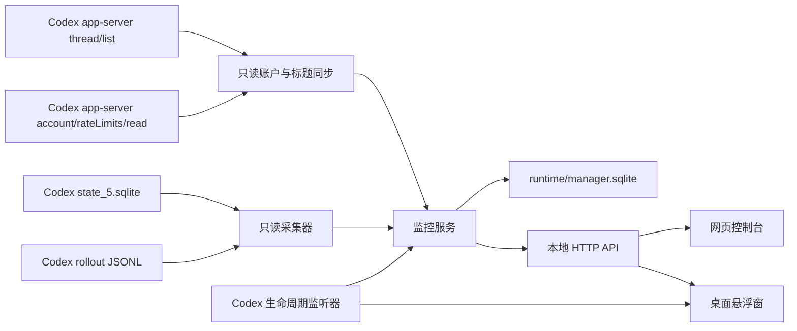

# Codex Token 用量监控

面向 Windows Codex Desktop 的本地只读 Token 与额度监控工具。项目包含一个跟随 Codex 显现、可手动置顶的桌面悬浮窗，以及一个适配电脑和 iPad 的实时网页控制台。

它会读取 Codex 已经写入本机的任务索引、rollout 日志、额度窗口和只读任务列表，不修改 Codex 数据库、日志、任务内容或 Git 分支。未显式指定数据目录时，采集器会比较候选 Codex 主目录的数据库活动时间，自动选择当前正在写入的目录，避免继续读取迁移前的旧数据。

> [!IMPORTANT]
> 五小时任务预算是根据本地采样生成的 Token 估算，不是 OpenAI 官方配额，也不会自动暂停、中断或恢复 Codex 任务。账户剩余百分比仍直接来自 Codex；两者不是固定换算关系。

## 功能概览

### 桌面悬浮窗

- Codex Desktop 启动后自动出现，Codex 完全退出后自动关闭。
- 每秒刷新短周期额度、周额度、今日 Token、本周 Token、活动任务、当前任务累计、本轮消耗和消耗速度。
- 账户额度通过本机只读 `account/rateLimits/read` 每 2 秒同步；接口暂不可用时自动退回 rollout 额度事件。
- 多个并行任务分别显示，不把不同任务的本次用量合并成一条记录。
- 每个运行/等待任务显示五小时已用 Token、可用预算估算和预计耗尽时间；窗口、任务数量、速度或优先级变化时重新分配。
- Codex 侧栏重命名通过本机只读 `thread/list` 每 2 秒同步；同步中断时使用本项目缓存，不退回长对话内容。
- 任务结束后保留最近一批工作结果，直到下一批任务开始。
- 支持拖动、最小化、隐藏和手动置顶；默认是可被其他窗口盖住的普通窗口。
- 默认使用夜间模式，可在弹窗顶部切换日间模式，并保存主题偏好。
- 使用 Windows 工具窗口样式，不单独占用任务栏图标。
- 点击叉号仅隐藏悬浮窗，再次点击或切回 Codex 时会重新显示。

### 网页控制台

- 实时显示短周期、周周期、今日用量、运行任务数、本轮消耗合计和当前任务累计 Token。
- 首屏优先展示活动任务，并用最近任务补足 5 行；超过 5 个活动任务时，列表可滚动查看全部活动任务。
- 点击任务名称查看任务累计/本轮消耗、输入、缓存输入、输出、推理输出、运行时长、模型和工程目录。
- “全部任务”支持按名称、模型或工程目录搜索，并按状态筛选。
- 额度趋势以 6 小时和 24 小时为上限，按最近连续采样时长自适应横轴；中断超过 90 分钟才开始新连续段。鼠标或触摸可查看十字线对应时刻的额度与 Token，点击可锁定。
- 默认使用高对比度夜间模式，可在顶栏切换日间模式，并在本机保存主题偏好。
- 支持导出当前只读 JSON 快照。
- 支持任务本地监控名称、优先级和手动建议上限。
- 任务行和详情显示五小时预算估算、已用量和耗尽预测，悬浮窗与网页共用同一份 API 数据。
- 适配桌面浏览器、11 英寸 iPad 横屏/竖屏以及窄屏设备。
- 提供 PWA manifest，可从 iPad Safari 添加到主屏幕。

## 数据流与架构


```mermaid
flowchart LR
    A[Codex state_5.sqlite] --> C[只读采集器]
    B[Codex rollout JSONL] --> C
    J[Codex app-server thread/list] --> K[只读账户与标题同步]
    L[Codex app-server account/rateLimits/read] --> K
    K --> D
    C --> D[监控服务]
    D --> E[runtime/manager.sqlite]
    D --> F[本地 HTTP API]
    F --> G[网页控制台]
    F --> H[桌面悬浮窗]
    I[Codex 生命周期监听器] --> D
    I --> H
```

核心组件：

| 组件 | 作用 |
| --- | --- |
| `codex_monitor/collector.py` | 只读采集 Codex 任务、Token、状态和额度窗口 |
| `codex_monitor/title_source.py` | 通过本机 app-server 只读同步账户额度和 Codex 侧栏任务名称 |
| `codex_monitor/store.py` | 保存本项目自己的采样历史、任务偏好和最近任务名称缓存 |
| `codex_monitor/budget.py` | 计算安全预算池和每个活动任务的建议上限 |
| `codex_monitor/service.py` | 每秒刷新快照并组合网页/悬浮窗所需数据 |
| `app.py` | 提供本地 HTTP API 和静态网页 |
| `desktop_widget.py` | Windows 桌面悬浮窗 |
| `codex_link.py` | 监听 Codex Desktop 生命周期并启动/停止监控 |
| `web/` | 响应式网页控制台和 PWA 文件 |

## 指标口径

### Token

Codex rollout 中的 Token 口径：

```text
总 Token = input_tokens + output_tokens
cached_input_tokens 是 input_tokens 的子集
reasoning_output_tokens 是 output_tokens 的细分
```

网页中的主要数字：

| 指标 | 含义 |
| --- | --- |
| 任务累计 | 单个 Codex 任务从创建到当前、包含所有轮次的累计总量 |
| 本轮消耗 | 当前或最近一轮相对该轮开始基线的 Token 增量 |
| 当前任务累计 | 当前运行/等待确认任务各自任务累计 Token 的合计；只有一个活动任务时就是该任务累计 |
| 本轮消耗合计 | 当前并行批次中各任务本轮消耗的合计 |
| 今日花费 | 每个对话当前累计减去本地当天零点前最后一次累计，再求和 |
| 本周消耗 | 每个对话当前累计减去当前周额度窗口开始前最后一次累计，再求和；周额度窗口更新后归零 |
| 消耗速度 | 最近采样窗口内任务累计 Token 的增量/分钟 |

任务之间使用独立 task ID 计算，不会把不同任务的本轮消耗串在一起。

### 账户额度

短周期和周周期优先使用本机 Codex app-server 的只读 `account/rateLimits/read` 返回值：

- `usedPercent`
- `windowDurationMins`
- `resetsAt`

监控器不会把本地 Token 数量伪装成账户剩余额度。账户接口成功时，其完整快照会覆盖 rollout 中可能仍属于重置前周期的旧值，因此使用一次性额度重置后无需等待下一个任务 Token 事件。账户接口超过 10 秒没有成功结果时，服务自动退回 rollout 的 `rate_limits`，不会因临时接口异常清空已有额度。`GET /api/status` 的 `quota_source` 和 `title_sync.quota_*` 字段可用于核对当前来源、更新时间和健康状态。

### 建议预算

新预算以 **本地估算 Token** 为单位。默认安全余量仍以账户额度百分点设置：

- 短周期保留 `10%`
- 周周期保留 `15%`
- 单任务建议最多占本地估算五小时总容量的 `40%`

**校准依据**：记录同一额度窗口内的账户 `usedPercent` 与同期本地 rollout Token 正增量。至少经过 30 秒、消耗变化达到 2 个百分点且本地 Token 增量大于零，才用 `Token 增量 / 额度百分点增量` 作为该窗口的经验比率。样本保存在本项目的 `runtime/manager.sqlite`，服务重启后可继续使用。

五小时窗口与周窗口分别校准，先换成各自的 **估算 Token** 再比较，不能直接比较两个窗口的百分点。安全池取以下约束中的较小值，再扣除已知但尚未被最新账户上报覆盖的本地消耗：

1. `(五小时剩余百分点 - 10) × 五小时经验比率`。
2. 如果账户提供周窗口：`(周剩余百分点 - 15) × 周经验比率 / 周内剩余五小时周期数`。

结果向下取整且不小于零。各任务分配之和不会超过这个池；单任务上限可能使部分池保持未分配。账户没有五小时窗口时，不凭周百分比虚构五小时 Token 容量。

活动任务的自动建议同时考虑：

- 任务优先级：优先级越高，建议份额越大。
- 实测消耗速度：高消耗任务会适当降低份额，避免快速耗尽预算池。
- 当前活动任务数量：多个任务共享同一安全预算池。

手动百分比指 **本地估算五小时总容量的目标比例**，不是官方 Token 配额，也不是历史已用量。手动目标先占用池，单任务仍受 40% 上限约束；所有手动目标合计超出池时按比例缩小，余下部分再自动分配。等待确认的任务保留份额，但不显示虚假的耗尽时间。

显示口径：

| 指标/状态 | 含义 |
| --- | --- |
| 五小时已用 | 当前账户五小时窗口 `resetsAt - windowDurationMins` 至现在的该任务 rollout Token 增量；计数器归零时按新段从零累计，不丢失首条增量；不是任务累计或单轮消耗 |
| 可用估算 | 该任务从现在到当前五小时窗口刷新前的本地建议剩余预算 |
| 建议总量估算 | 当前窗口已用 + 当前分配的可用估算；并非固定不变的官方上限 |
| 约 X 分钟耗尽 | 当前可用估算除以任务最近采样消耗速度；仅预测，不会触发暂停 |
| 刷新前充足 | 按当前速度预测不会在五小时刷新前耗尽；不延伸到新窗口 |
| 校准中 | 对应窗口尚无足够样本，预算与耗尽时间均未知，API 使用 `null`，不是零 |
| 等待额度 | 必需的账户额度缺失、过期或等待新上报，停止给出预算估算，保留仍有效窗口的已用量 |
| 建议预算已用尽 | 本地安全池/任务分配已为零，不表示 Codex 官方额度一定用完 |

周期重置、额度降低后重新上涨、数据源/任务集合/模型变化或本地累计断点都会隔离校准样本。仅使用最近五小时内、属于同一周期与数据范围的样本。账户百分比可能取整，不同模型、缓存、远端或未采集任务也可能改变换算关系，所以这个估算和耗尽时间不保证与 Codex 限额完全一致。它不调用模型、不新增 AI 审核或执行权限。

## 系统要求

- Windows 10 或 Windows 11
- Codex Desktop
- Python 3.11（当前测试版本）
- Windows PowerShell 5.1 或 PowerShell 7
- 电脑与 iPad 同网访问时，需要允许私有网络 TCP `8790`

项目运行只依赖 Python 标准库，不需要 `pip install` 第三方包。

## 快速启动

克隆仓库后进入项目目录：

```powershell
Set-Location <仓库目录>\codex_quota_manager
```

启动监控服务：

```powershell
powershell -ExecutionPolicy Bypass -File .\start_dashboard.ps1
```

电脑浏览器访问：

```text
http://127.0.0.1:8790/display
```

停止监控服务：

```powershell
powershell -ExecutionPolicy Bypass -File .\stop_dashboard.ps1
```

## 与 Codex Desktop 自动联动

安装当前 Windows 用户的启动项：

```powershell
powershell -ExecutionPolicy Bypass -File .\install_codex_link.ps1
```

安装脚本会在当前用户的 Windows“启动”目录创建快捷方式。登录 Windows 后，后台监听器常驻，但只有检测到 Codex Desktop 进程树时才会启动网页服务和悬浮窗。

监听器独立于启动它的终端或 Codex 宿主进程运行。关闭 Codex 时只停止网页服务和
悬浮窗，监听器保留；再次打开 Codex 会自动恢复监控，不需要重新登录 Windows。
启动脚本会核对 PID 对应的进程名称及本项目脚本路径，过期或被其他进程复用的
PID 不会阻止启动，重复执行也不会再创建一个监听器。
如果宿主禁止启动独立后台进程，脚本会明确报错而不是虚报成功；此时从 Windows
PowerShell 运行 `start_codex_link.ps1`。脚本不会修改宿主限制、注册表或系统启动项。

联动行为：

1. 打开 Codex Desktop。
2. 监听器启动 `app.py` 和 `desktop_widget.py`。
3. 网页与悬浮窗每秒读取同一份实时快照。
4. 完全退出 Codex Desktop。
5. 监听器关闭悬浮窗和网页服务。

点击悬浮窗的叉号会隐藏窗口，后台监测继续运行。再次点击或切回 Codex，
悬浮窗会自动恢复到前面，但不会自动开启置顶，也不改变 Codex 的键盘输入焦点。
悬浮窗使用 Windows 原生 owner 关系跟随当前 Codex 主窗口，不依赖一次性抬窗；
Codex 随后的窗口排序不会再次盖住悬浮窗，最小化及恢复也跟随该窗口。
重新激活其他 Codex 窗口时会更新关联，关联不会写入偏好设置或修改 Codex 本身。
切到浏览器等其他窗口后，悬浮窗可正常被盖住；只有手动点击“置顶”才会一直浮在最前。
手动置顶选择会单独保存，旧版自动唤醒误存的置顶状态不再沿用，窗口位置和主题不受影响。
旧版本遗留的手动关闭标记不再阻止悬浮窗启动。完全退出 Codex 后，悬浮窗仍会自动退出。

监听器每 5 秒检查服务状态。服务启动超时、脚本失败或服务退出后会继续重试，
不会因一次启动失败终止监听。Codex 进程连续消失 5 秒后才执行关闭，避免短暂
进程切换造成误关闭；悬浮窗也会独立执行这个检查，并在本地服务恢复后继续刷新。
本机健康检查和悬浮窗请求直接连接回环地址，不使用系统或环境中的 HTTP 代理。
连接错误与恢复记录在 `runtime/desktop_widget.log`，生命周期错误记录在
`runtime/codex_link.log`。

“今日花费”保留万/亿单位的概览，并在下方显示精确到整数的 Token 总数，例如
`290,123,456 Token`；刷新倒计时仍保留。这是今日累计值，不是逐次请求明细。

手动启动或停止监听器：

```powershell
powershell -ExecutionPolicy Bypass -File .\start_codex_link.ps1
powershell -ExecutionPolicy Bypass -File .\stop_codex_link.ps1
```

卸载 Windows 启动项：

```powershell
powershell -ExecutionPolicy Bypass -File .\uninstall_codex_link.ps1
```

## iPad 使用

1. 电脑与 iPad 连接同一个可信 Wi-Fi。
2. 启动监控后，PowerShell 会输出类似以下地址：

```text
http://192.168.1.20:8790/display
```

3. 在 iPad Safari 打开该地址。
4. 选择“共享” -> “添加到主屏幕”。
5. 需要专用显示时，可关闭自动锁屏或使用“引导式访问”。

电脑悬浮窗和 iPad 网页可以同时显示。数据线只负责供电，不会自动建立网页连接。

如果 iPad 无法访问，以管理员身份运行：

```powershell
powershell -ExecutionPolicy Bypass -File .\allow_private_firewall.ps1
```

该脚本只为 Windows 私有网络配置 TCP `8790` 入站规则。

> [!WARNING]
> 网页服务默认监听 `0.0.0.0:8790`，没有登录鉴权。只应在可信局域网使用，不要在路由器上做公网端口映射。

## 网页操作

### 任务名称

任务名称按以下优先级显示：网页手动“监控名称” > Codex 侧栏名称 > 短数据库标题 > 任务编号。Codex 侧栏在新建后命名、运行中改名或间隔一段时间后再运行，都会由只读标题通道重新同步。同步成功的名称会缓存在本项目的 `runtime/manager.sqlite`，重启和短暂断线时不会退回“未命名任务”或长对话内容。

网页手动“监控名称”仍是最高优先级，只保存在本项目中，不会修改 Codex 对话标题。清空该字段即可恢复跟随 Codex 侧栏名称。

### 优先级

优先级范围为 `1` 到 `5`。它只影响多个自动预算任务之间的建议权重：

- `1`：低
- `2`：较低
- `3`：普通
- `4`：较高
- `5`：最高

手动目标优先占用安全预算池，剩余部分再按自动任务的优先级和消耗速度分配。

### 手动建议上限

- 留空：任务运行时自动计算。
- 输入百分比：保存为该任务相对本地估算五小时总容量的手动目标。
- 点击“自动”：清除手动目标并恢复自动建议。

这些设置不会操作 Codex 进程，也不会自动停止任务。

## 本地 API

### 获取完整状态

```http
GET /api/status
```

返回任务、Token 分项、额度窗口、预算建议、趋势历史、今日用量和告警。

五小时预算字段：

- `budget_plan.token_budget`：`state`、`available_tokens`、`active_tasks`、窗口起止、`calibrations`、`unreported_tokens` 和分配表；`is_estimate`、`advisory_only` 固定为 `true`。
- `tasks[].budget.token`：该任务的 `window_used_tokens`、`remaining_tokens`、`suggested_total_tokens`、`burn_rate_tokens_per_minute`、`forecast`、`seconds_remaining`、`exhausts_at` 和 `mode`。非活动任务为 `null`。
- `turn_display.tasks[].token_budget`：与任务的 `budget.token` 相同，悬浮窗直接使用，不在客户端重复计算。
- `forecast` 可为 `exhausts`、`after_reset`、`waiting`、`unknown_rate`、`exhausted`、`calibrating`、`awaiting_quota` 或 `unavailable`。无法估计时预算/耗尽字段为 `null`；零预算明确返回 `0`。

旧的 `available_percent`、`cap_percent` 等字段保留兼容旧客户端，仅是历史百分比建议，不能当作 Token 配额，也不用于新版 Token 分配和显示。

### 健康检查

```http
GET /health
```

### 更新任务本地设置

```http
POST /api/tasks/{task_id}/settings
Content-Type: application/json
```

示例：

```json
{
  "display_name": "Token监控项目",
  "priority": 4,
  "manual_cap_percent": 2.5
}
```

将 `manual_cap_percent` 设置为 `null` 可恢复自动建议。

## 目录结构

```text
codex_quota_manager/
├── app.py                         # HTTP 服务入口
├── codex_link.py                  # Codex 生命周期监听器
├── desktop_widget.py              # Windows 悬浮窗
├── codex_monitor/
│   ├── budget.py                  # 建议预算算法
│   ├── collector.py               # Codex 本地数据采集
│   ├── models.py                  # 数据模型
│   ├── service.py                 # 实时快照服务
│   ├── store.py                   # 本地历史、名称缓存与偏好存储
│   └── title_source.py            # Codex 侧栏名称只读同步
├── web/                            # 网页控制台与 PWA
├── tests/                          # 单元测试
├── runtime/                        # 运行数据，不提交 Git
├── start_dashboard.ps1
├── stop_dashboard.ps1
├── install_codex_link.ps1
└── uninstall_codex_link.ps1
```

## 测试

```powershell
Set-Location <仓库目录>\codex_quota_manager
py -3.11 -m unittest discover -s tests -v
node --check .\web\app.js
```

浏览器与原生窗口检查使用独立的内存测试数据，不启动任务，不修改正式监控偏好。可用已有 Playwright 安装运行：

```powershell
node .\tests\browser_budget_smoke.cjs <已安装的playwright包目录> <浏览器exe路径> 8791
python -B .\tests\native_budget_smoke.py
```

浏览器检查覆盖桌面/平板/手机布局、日夜主题、手动预算、优先级、详情、等待/校准/额度缺失/预算用尽等状态。原生窗口检查需要 Pillow，仅用于测试截图，日常运行不需要安装；截图位于忽略提交的 `output/playwright/`。

当前测试覆盖：

- Token 与额度窗口解析
- 本次任务 Token 基线
- 并行任务批次显示
- 今日 Token 零点基线
- 自动/手动预算及超额缩放
- 本地偏好存储
- 趋势历史降采样
- Codex Desktop 进程识别

## 隐私与安全

- Codex 数据库使用 SQLite 只读连接打开。
- 标题同步调用 `thread/list` 时固定使用 `useStateDbOnly=true`，不会触发 JSONL 扫描修复或写回 Codex 数据。
- 账户额度同步只调用本机 app-server 的 `account/rateLimits/read`，不消费重置次数，也不修改账户设置。
- 项目只读取当前 Codex 主目录中的 `state_5.sqlite`、WAL/SHM、`sessions` rollout 和任务列表元数据，不读取凭据目录，也不会写入 `CodexData` 或 `~/.codex`。
- 项目不会上传任务标题、Token 或额度数据。
- 所有历史、本地名称和最近 Codex 侧栏名称缓存保存在 `runtime/manager.sqlite`。
- `runtime/`、日志、PID、导出文件和浏览器测试缓存均被 `.gitignore` 排除。
- 网页中导出的 JSON 可能包含任务名称和本机目录，分享前应自行检查。

## 已知限制

1. Codex Plus 没有向该项目提供可强制执行的 Token 硬上限接口，因此预算只能用于规划和提醒。
2. Codex 服务端未提供某个额度窗口时，该窗口显示“未报告”；本机 app-server 不可用时更新速度取决于 rollout 额度事件。
3. 账户额度百分比与本地 Token 数量不是固定换算关系，不能用任务 Token 精确反推剩余百分比。
4. Codex 内部数据库和 rollout 格式未来可能变化，采集器可能需要适配。
5. 当前生命周期监听和桌面悬浮窗面向 Windows。
6. 电脑关机、Codex 关闭或监控服务停止后，iPad 无法继续访问实时页面。

## 常见问题

### 网页显示“短周期未报告”

这表示最近读取到的 Codex 事件没有携带短周期额度，不代表短周期额度为零。继续正常使用 Codex，等待服务端下一次返回额度窗口即可。

### iPad 打不开页面

确认：

1. 电脑和 iPad 位于同一 Wi-Fi。
2. 电脑访问 `http://127.0.0.1:8790/health` 正常。
3. Windows 网络类型为“专用网络”。
4. 已运行 `allow_private_firewall.ps1`。
5. iPad 使用的是电脑当前局域网 IPv4 地址。

### 端口 8790 被占用

先运行：

```powershell
powershell -ExecutionPolicy Bypass -File .\stop_dashboard.ps1
```

如果仍被占用，使用以下命令查看监听进程：

```powershell
Get-NetTCPConnection -LocalPort 8790 -State Listen
```

### 百分比输入后为什么没有停止任务

该输入框保存的是建议目标，不是执行开关。当前版本不会向 Codex 发送中断命令。

## 项目边界

本项目定位为本地可观测性与预算规划工具：

- 可以读取和展示任务状态。
- 可以计算建议预算和安全余量。
- 可以保存本地显示名称与优先级。
- 不会修改 Codex 对话。
- 不会擅自切换 Git 分支。
- 不会擅自中断或恢复任务。
